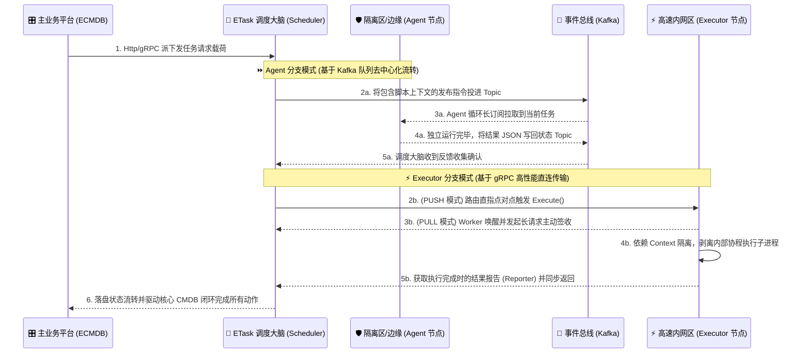

<div align="center">

# ⚙️ ETask - 分布式任务调度与异步执行引擎


</div>

## 🎯 核心功能

ETask 是 ECMDB 生态系统中的专业分布式任务执行组件。它主要用于解耦主应用的执行压力，通过分布式架构异步处理耗时的自动化运维剧本和巡检任务。

### 🛡️ **主站解耦与网络隔离**
- **全异步执行**：将耗时网络探活、配置收集、自动化剧本下发任务转交于 ETask 异步化，彻底防止主站阻塞。
- **高危操作沙盒化**：允许将 ETask 执行器部署在严格网络隔离的安全区，主控通过中心态的中间件传递指令，大幅度压缩暴露的核心安全侧攻击面。

### 🔄 **弹性架构与多链路分发**
仅需变更基础启动参数，即可灵活使单个二进制程序切换不同微服务角色（`Scheduler` / `Agent` / `Executor`），为严苛的防火墙环境演化出三套互补获取链路：
- **Kafka Agent 模式**：完全不需要监听外部入站端口，依靠主动订阅消息队列获取任务，从物理上隔绝外网反向探测。
- **gRPC PUSH 模式**：调度中心利用内部高速网络，直接向处于同一可信内网的节点集群发起高速点对点下抛推送。
- **gRPC PULL 模式**：执行节点定时利用长轮询向控制端认领任务，完美适配高网络限制或边缘侧弱网环境。

### 📦 **异构脚本结果标准化提取**
- **跨环境支撑**：全量支持透传解析各形态执行文件，如常见 Shell 脚本或封装依赖的 Python 工具链路。
- **结构化收集**：执行完毕不仅采集标准输出，更提供系统级的描述符管道 (FD) 挂载拦截，强制将结果转为标准 JSON 结构响应回主控系统。

## ⚙️ 核心处理调度流转架构

展现从 ECMDB 到内部调度分发，及多种派发通道到最后状态回流的并行逻辑网络视角：



## 🏗️ 角色启动与部署模式

通过启动命令的 `--mode` 参数设定当前程序所处的网络拓扑阶段。所有特性均编译在同一可执行文件内：

| 组件名称 | 说明 | 启动指令 |
| :--- | :--- | :--- |
| **Scheduler (调度大脑)** | 位于中心端，统筹从核心业务平台下发的具体编排载体，并负责在不同边缘执行集群中路由和重试。 | `go run main.go server --mode scheduler` |
| **Agent (消息代理端)** | 无需开放端口的静默节点，基于 Kafka 构建。专门部署于有着苛刻的出入站限制，只能对外联通的隔离网段。 | `go run main.go server --mode agent` |
| **Executor (原生直连端)** | 采用 gRPC rpc 构建的高并发节点，拥有最强的心跳发现机制与最低的延迟分发速度，适合部署在核心机房圈中。 | `go run main.go server --mode executor` |

> 💡 **聚合模式提示**: 当进行开发测试或者只有一台宿主机可利用时，可使用 `go run main.go server --mode all` 将以上三大组件融合捆绑在一个常驻进程内。

## 💻 后端核心技术矩阵

保证分布式环境下的可用性与长平稳心跳探测，所有强依赖均围绕企业级常见组件：

- **开发语言与引擎**：Go 1.25.0、[Ego](https://github.com/gotomicro/ego) (基础框架)、gRPC (底层通讯规范)
- **调度存储依赖**：MySQL (支持 Egorm 操作基础数据与任务载荷)
- **高性能去中心化总线**：Kafka (承载异步任务与大规模执行回传状态池)
- **注册与发现**：Etcd (心跳保活续期、租约签发与在线 Endpoint 热同步)

## 📚 本地开发与联调指南

本系统在根目录使用 `Taskfile.yaml` 聚合了常用的环境准备与启动测试工作：

### 1. 基础环境与代码生成
开始联调前，务必保证开发主机能连通测试环境的 **Kafka** 与 **Etcd**。配置路径：`config/all.yaml`。

```bash
# 整理并拉取 Go 模块包
go mod tidy

# 依赖 Buf，重新针对修改过的 Protobuf (api层) 生成通信存根
task gen

# 利用 Wire 生成项目的自动化控制反转 (DI) 依赖注入层
task wire

# 初始化并根据对应库执行数据库结构强制同步建表
task migrate:up
```

### 2. 多态服务快捷启动
开发调试提供了专属的 task 命令别名，用于模拟网络中的多个物理角色节点：

```bash
# 【一键体验】同时拉起具有分发中心与本地执行能力的全量引擎
task run               

# 【仅启动主控】剥离执行单元，单纯监听业务网关请求
task scheduler         

# 【启动隔离节点】专门订阅 Kafka 队列来干活的不开放端口节点
task agent             

# 【启动直连节点】对外暴露 gRPC 执行端口等待指派任务分配的集群节点
task executor          
```

---

<div align="center">

**🌟 如果这个核心执行中枢对您有帮助，请给我们一个 Star！**

Made with ❤️ by [Duke1616](https://github.com/Duke1616)

</div>