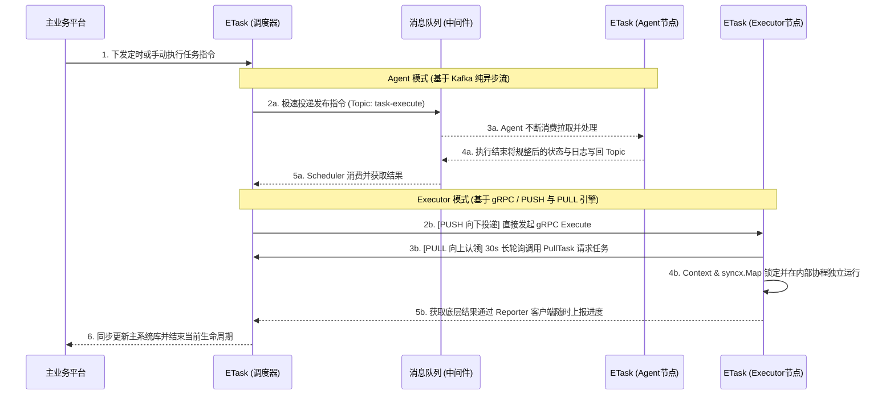

# ETask 分布式异步执行引擎

ETask 是 ECMDB 生态系统中的分布式任务执行组件。它主要用于解耦主应用的执行压力，通过分布式架构异步处理耗时的自动化运维剧本和巡检任务。

## 核心特性

### 主站解耦与网络隔离
将耗时任务异步化，防止主站阻塞；ETask 可部署在隔离网络，通过中间件转发指令，降低安全风险。

### 异构脚本结果标准化
支持 Python、Shell 等脚本，利用 FD3 或标准输出捕获，将结果统一转为 JSON。

### 弹性架构与多链路分发
仅需变更启动参数即可灵活切换程序角色（`Scheduler` / `Agent` / `Executor`）。针对企业严苛的防火墙环境，演化出三套互补的任务获取链路：
- **Kafka Agent**：在无外部入口的网络环境中，通过消息队列主动获取任务。
- **gRPC PUSH**：调度中心直接向内部节点推送任务，响应快速。
- **gRPC PULL**：执行节点主动轮询获取任务，适用于受限网络环境。


---

## 架构与组件模式

ETask 支持通过启动命令的 `--mode` 参数以不同角色运行，以适应不同的网络部署环境：

### Scheduler (调度节点)
负责具体任务的组装、分发和执行状态监听。从核心后台接管执行指令，下发给可用的工作节点，并处理返回的终态结果。
```bash
go run main.go server --mode scheduler
```

### Agent (消息代理节点)
基于 Kafka 消息队列构建的无状态执行节点。通过订阅 Topic 主动拉取任务，适用于部署在具有严格入站网络防火墙限制（无法被主动链接）的独立内网环境。
```bash
go run main.go server --mode agent
```

### Executor (原生 RPC 节点)
基于 gRPC 框架对外提供跨服务点对点调用接口的执行节点。适用于与调度中心处于同一高速可控内网、追求调用低时延反馈的场景。
```bash
go run main.go server --mode executor
```

> **组合模式 (All)**：在本地开发联调或小型局域网部署时，默认支持使用 `--mode all` 参数，将上述三种能力组件聚合在同一进程中启动。

---

## 技术栈与依赖

- **开发语言**：Go 1.25.0
- **通信与中间件**：
  - **Kafka**：作为 Agent 模式下的任务分发消息总线。
  - **Etcd**：用于节点的服务注册发现与 TTL 心跳健康维护。
  - **gRPC / Protobuf**：底层 RPC 节点点对点通信规范实现。

---

## 本地开发指南

项目内集成了 `task` 作为常用开发及构建流程命令管理工具。

### 1. 环境准备
开发前请确保系统中已配置好 Go 1.25.0 环境，以及可用的 Etcd、Kafka 中间件服务。

> **💡 特别提示**：ETask 完全支持独立部署。若需接入 ECMDB 生态，请确保两边连接的是**同一个 Etcd 与 Kafka 集群**。

配置信息默认加载路径为 `config/all.yaml`。

### 2. 初始化与代码生成
安装依赖、生成协议与依赖注入代码，并执行数据库表结构迁移：
```bash
# 整理 Go 模块依赖
go mod tidy

# 重新生成基于 Protobuf (v1) 的 gRPC 协议文件
task gen

# 利用 Wire 生成项目的控制反转（依赖注入）关联代码
task wire

# 执行数据库表结构迁移（连接凭证读取自 .env）
task migrate:up
```

### 3. 多场景服务启动
项目使用 `task` 封装了启动命令，底层均映射至 `go run main.go server --mode xxx`：

```bash
# 【单体体验】启动大全量模式（同时挂载 Scheduler、Agent 和 Executor）
task run               # 相当于: go run main.go server --mode all

# 【大脑启动】仅启动充当分发决策中心的 Scheduler 节点
task scheduler         # 相当于: go run main.go server --mode scheduler

# 【无状态边缘】专门为具有入站限制的内网代理启动，拉取 Topic
task agent             # 相当于: go run main.go server --mode agent

# 【微服务直通】启动原生 gRPC 执行器，接受内网的极速派发
task executor          # 相当于: go run main.go server --mode executor
```